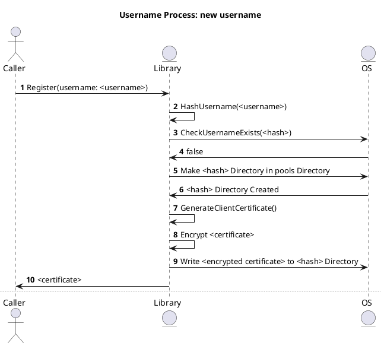
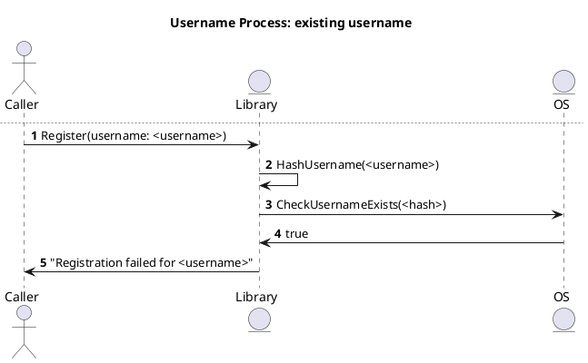
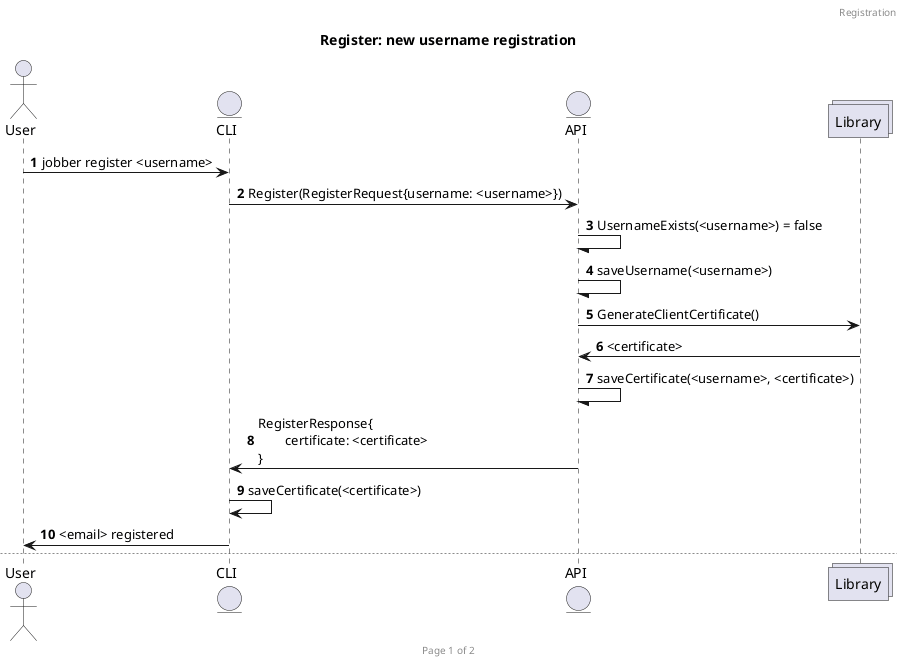

# Plan

## Library

### Security concerns

There are security concerns to take into consideration when storing sensitive information such as the:

1. usernames
1. certificates

The threats that this library currently covers are:

1. Intrusion into the server (having direct access to the OS)
1. Brute force attack against the username

To mitigate these threat of data leakage through these factors, the library does the following:

1. Stores all usernames with sha256 hash (so that if the data is leaked, it becomes hard to brute force who it is)
1. Encrypts all certificates that are stored in the user hash directory (so that if the data is leaked, it becomes harder to obtain the certificate)
1. Never return a hint that a username does or does not exist (so that an attack cannot guess if a username exists or not)

### Storage

The libarary will store information is this structure:

```
<root>
├── pools
│   ├── <sha 256 hash of username>
│   │   └── <encrypted certificate>
│   └── ...
└── ...
```

### Certificate encryption

Every certificate will be encrypted at rest. The private key for the encryption will made available via a OS enviroment variable so that the library has access to it.

### Username registration process

There are two outcomes when registering a username. Either:

1. The username does not exist
1. The username exists

#### Username does not exist

When a username does not exists, we follow the following process:

1. Create a sha256 hash of the username
1. Make a directory in the pools directory named the generated hash
1. Generate a client certificate
1. Encrypt the client certificate
1. Store the encrypted certificate in the generated hash directory
1. Return the unencrypted certificate



#### Username exists

When a username exists, we return a non-descript error such as `Registration failed for <username>`. We do not expose why the registration failed.



## API

### mTLS support

#### Registration

In order to support mTLS, the client must have a way to get the client cert. For that, a registration layer has been added to the service, represented in this protobuf:

```
message RegisterRequest {
    string username = 1;
}

message RegisterResponse {
    string certificate = 1;
    string error = 2;
    string info = 3;
}

service Jobber {
    //...
    rpc Register(RegisterRequest) returns (RegisterResponse);
    //...
}
```

We will be supporting two use cases:

1. A username is new
1. A username has already been registered

##### Username is new

TODO: write a summary



##### Username has already been registered

TODO: write a summary


