# The Plan

This plan is being created to help implement the [Teleport challenge 1, level 5](https://github.com/gravitational/careers/blob/main/challenges/systems/challenge-1.md#level-5).

## Library

### Features

The library will have the following features in the scope of this project:

1. Provide access to the certificates from a configuration
1. Manage jobs

### Provide access to the certificates from a configuration

This is a straightforward as reading the pools from the storage and providing them via a `func GetClientCertificates() ([]*Certificate, ErrorCertificate)` function.

If there are no certificatetes, it returns an empty slice of `*Certificate`.

If there was an error (e.g. read permissions issue) it returns a `ErrorCertificate` error.

### Manage jobs

In order to manage the jobs, the library will expose the following functions:

- `func NewCertificate(pem []byte) (cert *Certificate, err ErrorCertificate)`: instantiate and save a certificate from a pem
- `func (*Certificate) Bytes() (pem []byte)`: return the pem of a certificate
- `func (*Certificate) Hash() (hash string)`: sha256 hash the contents of a certificate
- `func (*Certificate) GetJobs() (jobs []*Job, err ErrorCertificate)`: get a list of jobs
- `func (*Certificate) GetJob(id int) (job *Job, err ErrorCertificate)`: get a job from id
- `func (*Certificate) GenerateJobID() (id int)`: generate the next ID for a job
- `func (*Certificate) NewJob(cmd string) (job *Job, err ErrorCertificate)`: instantiate a job with a command
- `func (*Job) Start() (err ErrorJob)`: start a job
- `func (*Job) ReadLog(writeTo []byte) (err ErrorJob)`: read all lines from the log, order from first to last
- `func (*Job) Stop() (err ErrorJob)`: stop a job

#### NewCertificate

The `NewCertificate` function takes a `[]byte` representation of a certificate.

It checks to see if the certificate is valid and returns a `*Certificate` if true. If false, it returns an `ErrorCertificate`.

If the certificate is valid but doesn't exist in storage, an entry in storage will be created with the certificate's hash.

Client certificate validation works like the following:

1. Hash the client certificate
1. Check to see if the certificate hash is in the client certificate hash pool
1. Return appropriate response (valid or not valid; true or false)

#### Bytes

The `(*Certificate) Bytes` function returns the pem of a certificate as a `[]byte`.

#### Hash

The `(*Certificate) Hash` function creates a sha256 hash of the certificate contents and returns that as a `string`

#### GetJobs

The function `(*Certificate) GetJobs` returns a list of jobs for a `*Certificate` hash in storage. If there is an error (e.g. problem with read permissions) it will return an `ErrorCertificate`.

#### GetJob

The `(*Certificate) GetJob` function takes an ID as a `int`.

It operates by looking up the job for a `*Certificate` hash in storage. If it is found it returns a `*Job`, otherwise it returns an `ErrorCertificate`.

#### GenerateJobID

The `(*Certificate) GenerateJobID` function generates a new ID for a future `*Job`. It does this by looking at the length of of the return from `GetJobs` and appending a Unix timestamp to it.

If it is successful, it returns the ID as an `int`. If there are no jobs returned, it defaults to 1 plus the Unix timestamp. If there was an error (e.g. read permissions issue in storage) it returns an `ErrorCertificate`.

#### NewJob

The `(*Certificate) NewJob` function attempts to create a job with a command for the certificate.

This instantiates a `*Job` with a generated ID (using `GenerateJobID`) and returns it. If it cannot generate the ID due to some error, it will return the `ErrorCertificate`.

#### Start

The `(*Job) Start` function attempts to start a `*Job` for a `*Certificate` hash in storage.

If the hash exists as a directory in storage, then we:

1. Create a directory of the jobID in the certificate directory
1. Create a cgroup for the job
1. Execute the job in a cgroup with output redirected to a log in the job directory
1. Write the job pid to the job directory

If there an error, it returns an `ErrorJob`.

#### ReadLog

The `(*Job) ReadLog` function takes a variable to write to as `[]byte` and attempts to read the job log. If it can read the log, it writes it to this variable. If it cannot read the log, it returns an `ErrorJob`.

#### Stop

The `(*Job) Stop` function attempts to stop the job. It does this by:

1. Reading the pid for the job
1. Killing the process
1. Removing the cgroup

If there is an error, then a `ErrorJob` is returned.

### Components

The library is layered in the following components:


Where:

- Storage is a layer to abstract away the configuration and temporary layers
- Storage contains many certificates
- Each certificate contains many jobs

### Storage

#### Configuration

The configuration will be in this structure:

<pre>
~/.jobber
├── pool
│   ├── certificate
│   └── ...
└── ...
</pre>

This allows us to store certs in a pool to be used at a future point in time.

#### Jobs

The jobs will be written as ephemeral to this structure:

<pre>
/
├── tmp
│   └── jobber
│       └── jobs
│           ├── sha256 hash of a certificate
│           │   ├── job id
│           |   |   ├── command
│           |   |   ├── log
│           |   |   └── pid
│           |   └── ...
│           └── ...
└── ...
</pre>

This gives us the ability to:

1. List jobs by a given certificate
1. Access to the details of a given job

## API

### Features

1. Start a job
1. Get a list of jobs
1. Get the logs of a job
1. Stop a job

### gRPC and mTLS

The **API** will use [gRPC](https://grpc.io/) and [protobufs](https://protobuf.dev/) for all communications, over [mTLS](https://en.wikipedia.org/wiki/Mutual_authentication#mTLS). This gives us a compact, type safe, data structure over a zero trust form of security.

Since we are sending over mTLS, we can treat the client certificate as the identifier for the user and will not need to create additional protobuf messages for the user authentication and verification.

### mTLS certificate behavior

1. All client certificates will be loaded when the server starts. For the sake of the MVP, we assume that no new certificates are being created while the server is running, and thus can rely on this method.
1. If a certificate is used that does not belong to the client certificate pool, the caller will recieve a HttpNotAuthorized response from the server.
1. If the certificate is valid, but a different certificate error has occurred while using it, an HttpInternalServerError response will be sent back with the appropriate error message.
1. If the certificate is valid and no errors have occurred, the request will be processed as normal

The following requests assume this behavior and will not touch on it in the description or diagrams.

Example workflows are provided below:

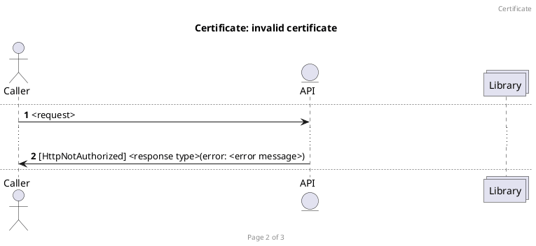
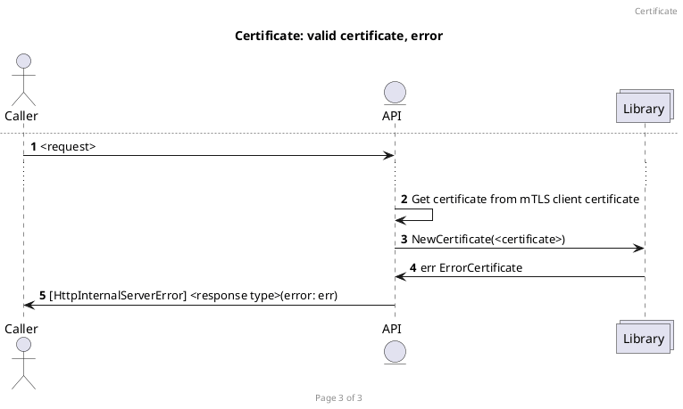
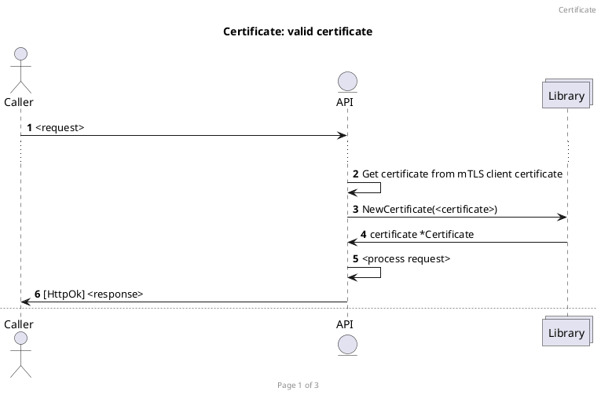

### A representation of a Job

A **Job** is an arbitrary command to be executed at a future point. We will need to be able to get its logs, get its status, and stop it mid run.

It could be represented like this:

```
message Job {
    int64 id = 1;
    string command = 2;
    string created_at = 4;
    bool finished = 6;
}
```

Where the:

- id: represents its ID in the system
- command: represents its command to be run
- created_at: represents when it was started
- finished: represents whether it is finished running or not

### Start a job

To `create` and `start` a **Job**, you would pass a **StartJobRequest** and recieve a **StartJobResponse** through the `StartJob` rpc as represented below:

```
message StartJobRequest {
    string command = 1;
}

message StartJobResponse {
    Job job = 1;
    string error = 2;
}
```

A successful request flow will look this:


If there is a problem starting the job, the flow will look like this:

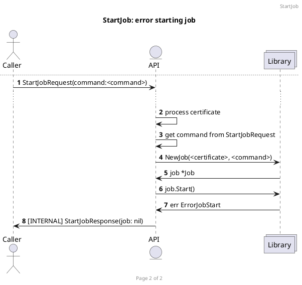

### Get a list of jobs

In order to more easily find a job - one you may want to get the detail of - it may be necessary to list all the current jobs. To that end, the `GetJobs` rpc exists.

You would pass a **GetJobsRequest** and recieve a **GetJobsResponse** through the `GetJobs` rpc as represented below:

```
message GetJobsRequest {
}

message GetJobsResponse {
    repeated Job jobs = 1;
    string error = 2;
}
```

If there are jobs to list, then you would recieve back a list of the jobs. The workflow would look like this:

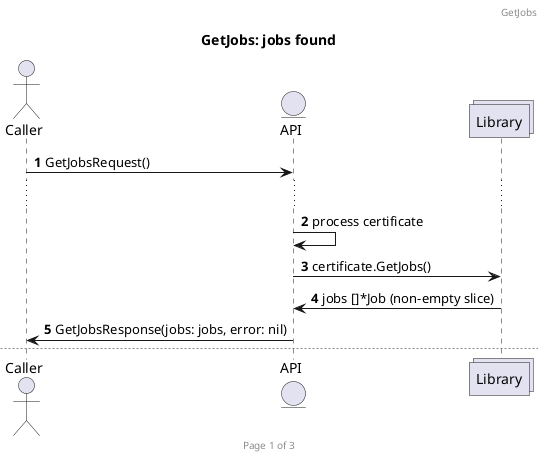

If there are no jobs to list, but no errors either, then you would recieve an empty list of jobs. The workflow would look like this:

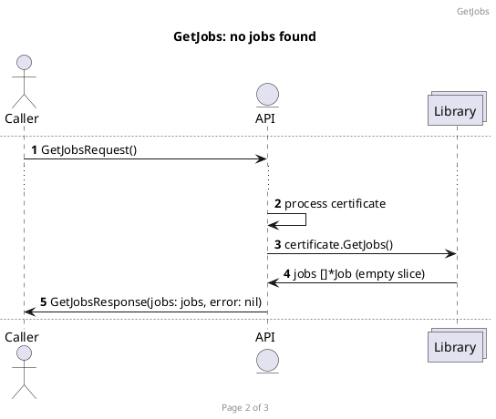

If an error arises, you would get a response back with the error filled out. The workflow would look like this:

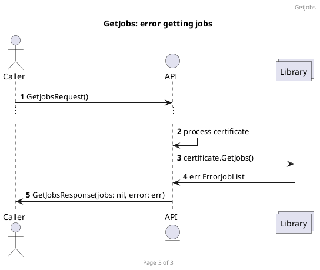

### Get the logs of a job

To get the logs for a **Job**, you need send the job ID in the request using the `GetJobLog` rpc. The messages for the protobuf look like this:

```
message GetJobLogRequest {
    int64 job_id = 1;
}

message GetJobLogResponse {
    string log = 1;
    string error = 2;
}
```

You can get the job ID by listing all jobs through the `GetJobs` rpc and choosing the job ID that you are interested in.

If a job exists, the workflow looks like this:

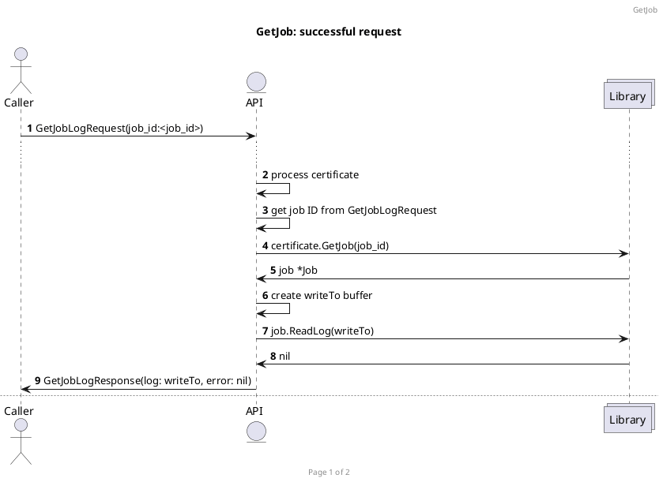

If a job does not exists, the workflow looks like this:

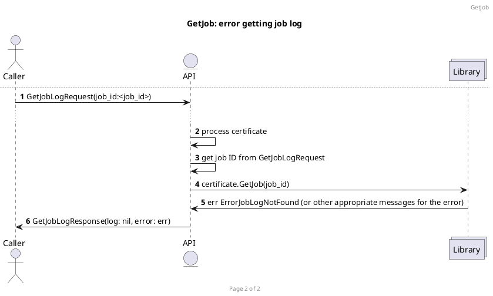

### Stop a job

In order to stop a **Job**, you need to send the job ID in the request using the `StopJob` rpc. The messages for the protobuf look like this:

```
message StopJobRequest {
    int64 job_id = 1;
}

message StopJobResponse {
    string error = 1;
}
```

A successful workflow looks like this:

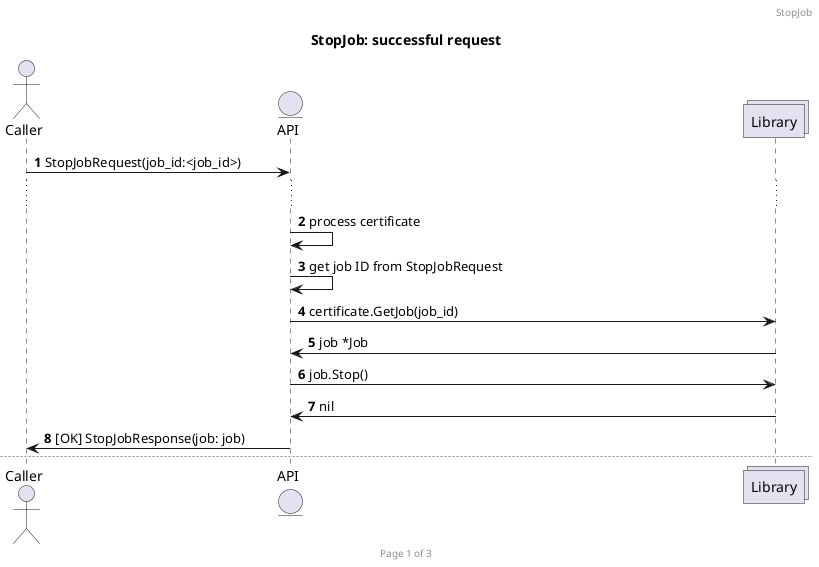

If the job has already been stopped, you should get an error. The workflow looks like this:

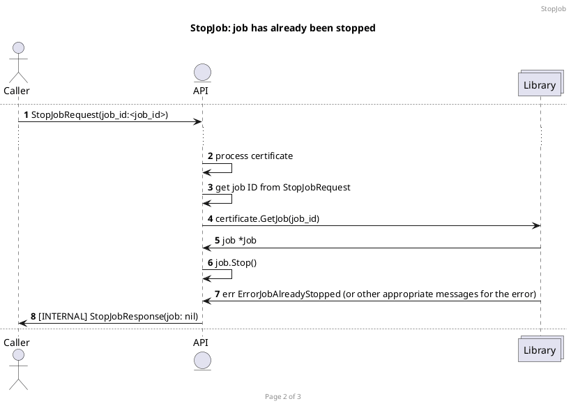

If there was any other error, the workflow looks like this:


## CLI

The CLI is used as an easy way to communicate with the API server to manage jobs.

### Features

- Start a job
- Get a list of jobs
- Get the log of a job
- Stop a job

### Command structure

The syntax to run a CLI command is: `jb <cli command> <options> <argument>`

### Start a job

To start a job, you use the `start` cli command and pass it a command as an argument: `jb start <options> ls -lah /`

A success will display the resulting details as a table like this:

```
Job started:
+---------------+---------------+---------------+---------------+
| ID            | Command       | Created       | Status        |
+---------------+---------------+---------------+---------------+
| 123456        | ls -lah /     | some date     | Running       |
+---------------+---------------+---------------+---------------+
```

You can get the logged streamed to you, using the `-f` option does on the log command, until `ctrl+c` is pressed. To get more, see options below.

A successful workflow for the cli command looks like this:

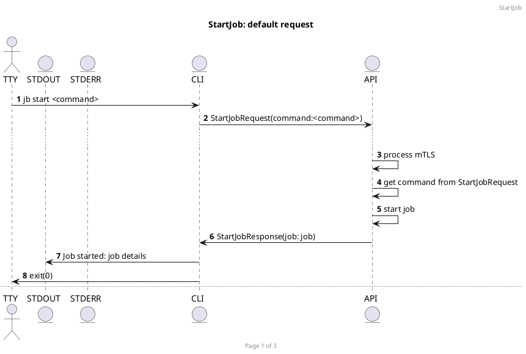

Using the tail workflow would look like this:


An unsuccessful workflow for the cli command looks like this:

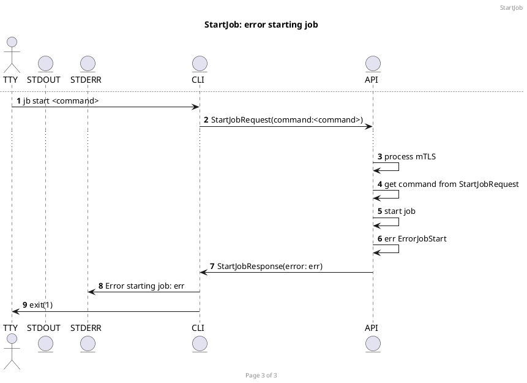

#### Options

| Flag  | Description           |
|-------|-----------------------|
| -f    | Tail log              |
| -q    | Quiet stdout messages |
| -json | Output as json        |


### Get a list of jobs

To list current jobs, you use the `list` cli command with no arguments: `jb list <options>`

A success will display the resulting jobs details as a table like this:

```
Jobs found:
+---------------+--------------------+---------------+---------------+
| ID            | Command            | Created       | Status        |
+---------------+--------------------+---------------+---------------+
| 123456        | ls -lah /          | some date     | Running       |
+---------------+--------------------+---------------+---------------+
| 654321        | echo "hello world" | some date     | Finished      |
+---------------+--------------------+---------------+---------------+
```

A successful workflow for the cli command looks like this:

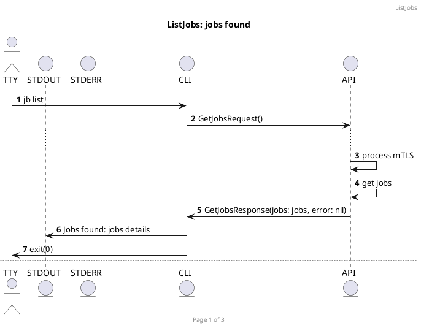

An empty list of jobs workflow for the cli command looks like this:

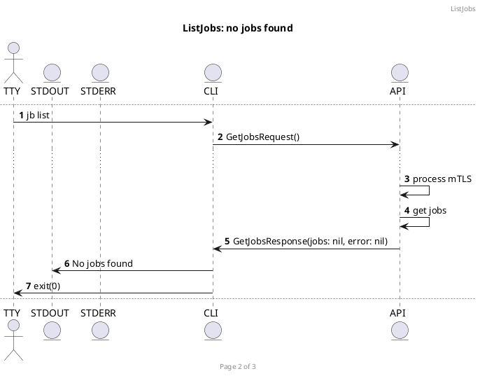

An error state workflow for the cli command looks like this:

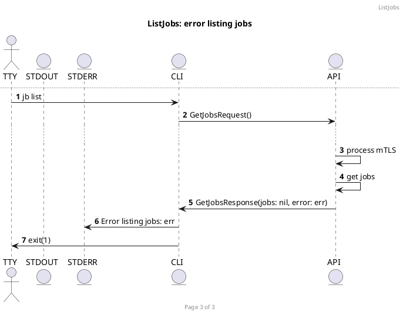

#### Options

| Flag  | Description           |
|-------|-----------------------|
| -json | Output as json        |

### Get the log of a job

To get the log of a job, you use the `log` cli command and pass it the job id as an argument: `jb log <options> 12345`

By default, a successful call with return the latest log snapshot, looking like this:

```
log line 1
log line 2
something else
etc...
log last line
```

A successful workflow looks like this:

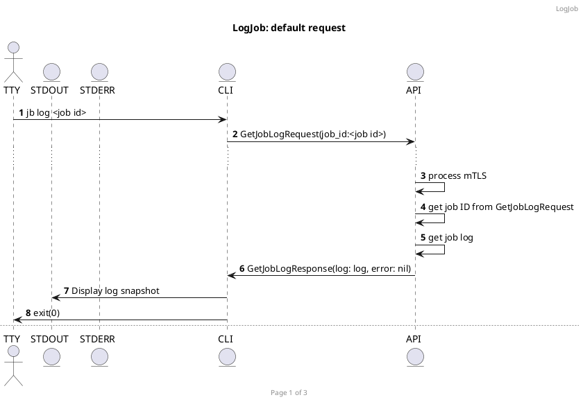

There is an option that replicates the linux command: `tail -f`. In this case, a successful call will stream the log to you, line by line until you press `ctr+c`.

A successful workflow looks like this:

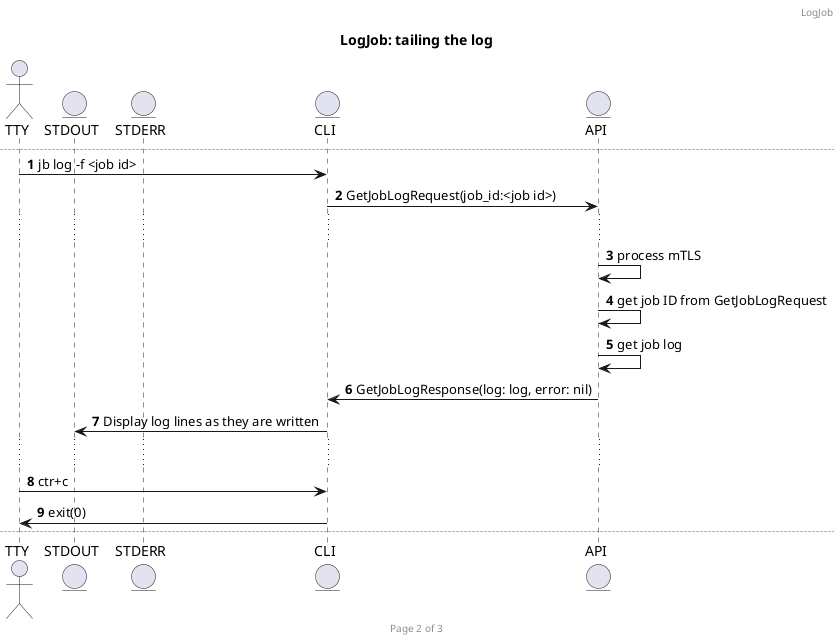

If there is an error in any of the calls, the workflow will look like this:

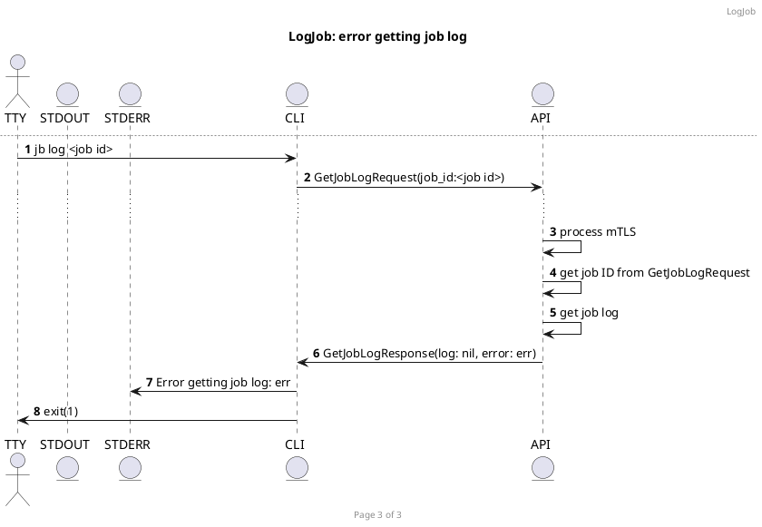

#### Options

| Flag  | Description           |
|-------|-----------------------|
| -f    | Tail log              |

### Stop a job

To stop a job, you use the `stop` cli command and pass it the job id as an argument: `jb stop <options> 12345`

The response of a successful call will display like this:

```
Job stopped:
+---------------+---------------+---------------+---------------+
| ID            | Command       | Created       | Status        |
+---------------+---------------+---------------+---------------+
| 123456        | ls -lah /     | some date     | Stopped       |
+---------------+---------------+---------------+---------------+
```

A successful request workflow looks like this:

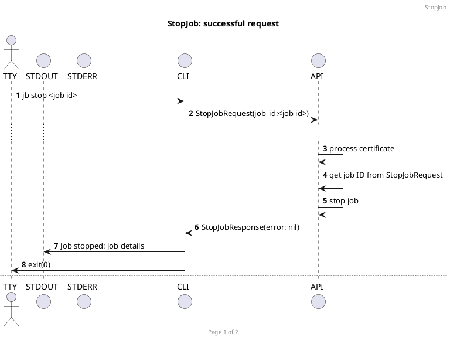

If there is an error, the workflow looks like this:

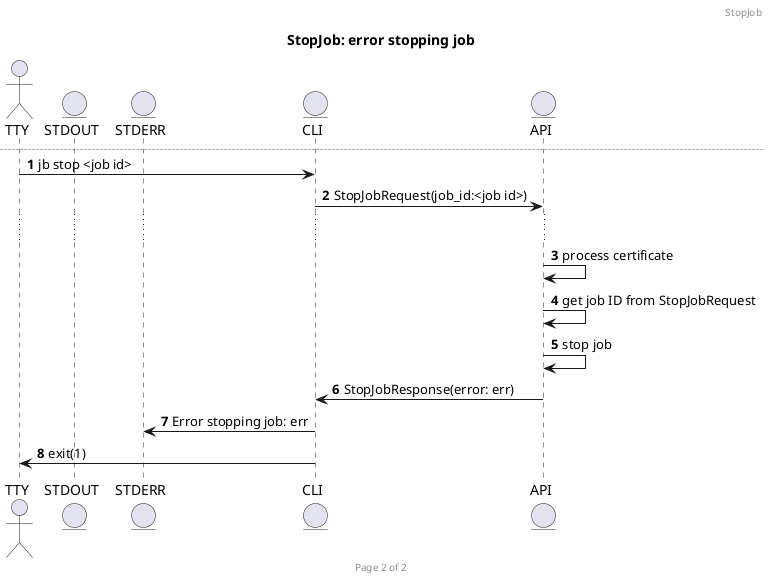

#### Options

| Flag  | Description           |
|-------|-----------------------|
| -json | Output as json        |
