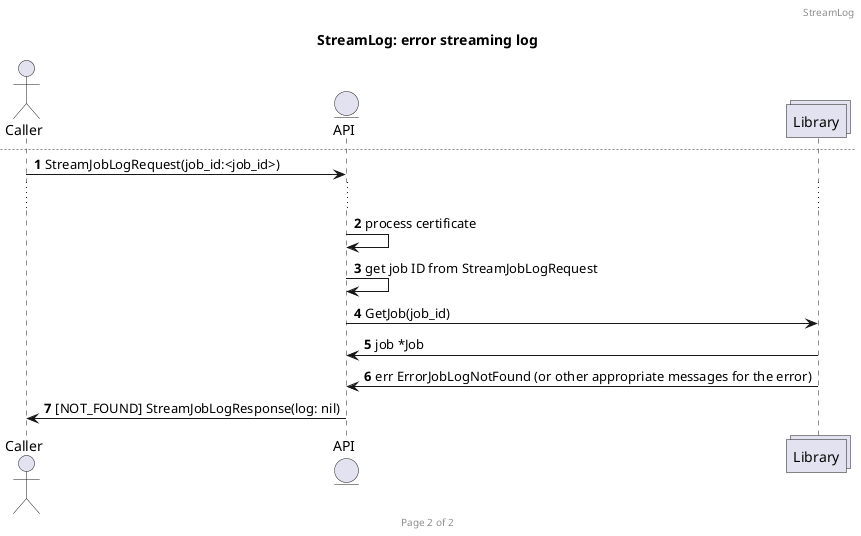
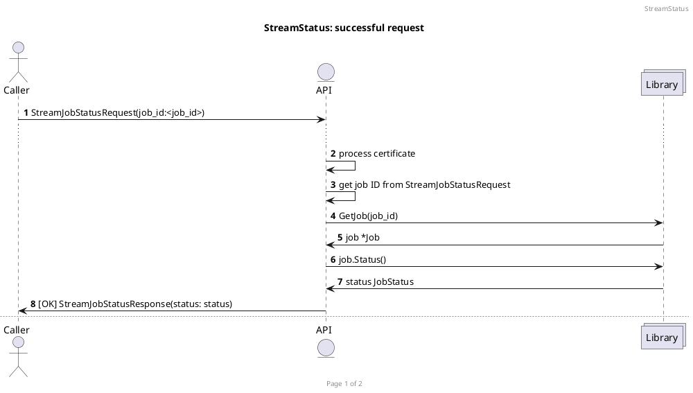
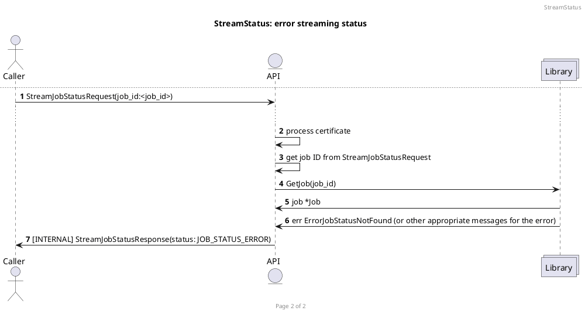
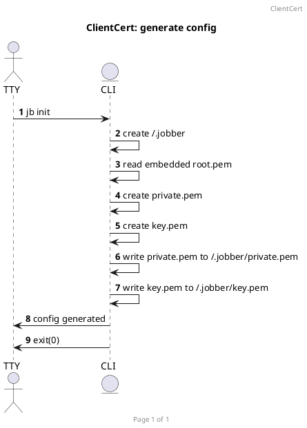
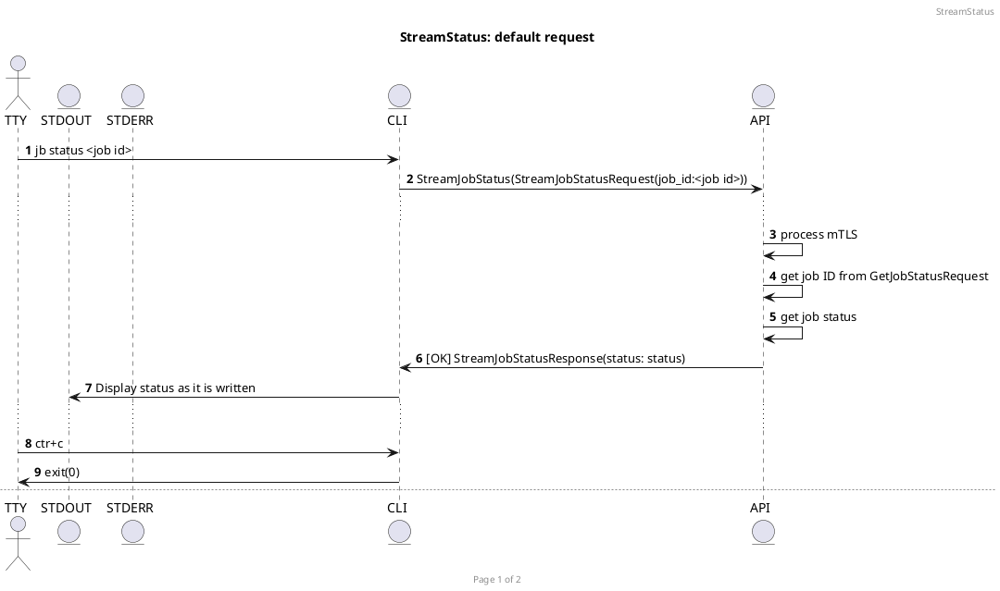
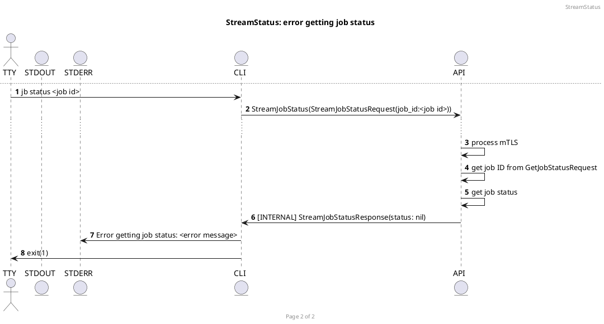

# The Plan

This plan is being created to help implement the [Teleport challenge 1, level 5](https://github.com/gravitational/careers/blob/main/challenges/systems/challenge-1.md#level-5).

## Overview

JobberTheHut is considered to be an open job running platform: anyone can run a job on it or view other jobs.

### Authorization

The project has these specific security constraints in regards to authorization:

- Anyone can start a job (with ensuing log stream)
- Anyone can view a job status (with ensuing log stream)
- Only the original owner of the job can stop it

We provide these guarantees through the following mechanisms:

- We use mTLS for client certificate authentication on each request
- We store metadata when each job is started that contains a hash of the owner's certificate, amoungst other data
- We compare each request certificate's hash against the owner hash for the stop job being requested, to ensure only the owner's certificate can stop it

### Resources

The project is resourced constrained per job. Each job has the following resource constraints:

- CPU: 25%
- MEM: 256MB

It achieves these constraints through the use of cgroups. When a job is started, the job is run in it through systemd-run with those constraints.

## Library

The library is only meant to be used by the API and is internal to the project.

### Features

The library will have the following features in the scope of this project:

- Manage jobs

### Job processing note

In order to decide on the status of, and further manage, a job:

- Whenever a job is waiting to start, the contents of the pid file in the job directory are nil
- Whenever a job is started, its PID is written to the pid file in the job directory
- Whenever a job process has not exited, the contents of the exit file in the job directory are nil
- Whenever a job process is stopped, the exit code of -1 is written to the exit file in the job directory
- Whenever a job process exits, the exit code is written to the exit file in the job directory
- Whenever a job process exits, the contents of the pid file in the job directory are nil

This gives us the ability to know the following:

| PID | Exit Code | Status    |
|-----|-----------|-----------|
| nil | nil       | PENDING   |
| >0  | nil       | RUNNING   |
| nil | -1        | STOPPED   |
| nil | 0         | COMPLETED |
| nil | >0        | ERROR     |

### Manage jobs

In order to manage the jobs, the library will expose the following functions:

- `func CertificateFrom(cert []byte) (certificate *Certificate, err ErrorCertificate)`: instantiate a `*Certificate` from a cert
- `func (*Certificate) Bytes() (pem []byte)`: return the bytes of a `*Certificate`
- `func (*Certificate) Hash() (hash string)`: sha256 hash the contents of a `*Certificate`
- `func GetJobs() (jobs []*Job, err ErrorJob)`: get a slice of `*job`
- `func GetJob(id int) (job *Job, err ErrorJob)`: get a `*Job` from id
- `func GenerateJobID() (id int)`: generate the next ID for a `*Job`
- `func JobFrom(cert *Certificate, cmd string) (job *Job, err ErrorJob)`: instantiate a `*Job` from a `*Certificate` and a command
- `func (*Job) Start() (err ErrorJob)`: start a `*Job`
- `func (*Job) Status() (err ErrorJob)`: get `*Job` status
- `func (*Job) ReadLog(writeTo []byte) (err ErrorJob)`: read all lines from the log, order from first to last
- `func (*Job) Stop() (err ErrorJob)`: stop a `*Job`

#### CertificateFrom

The `CertificateFrom` function takes a `[]byte` representation of a certificate.

It checks to see if the certificate is valid and returns a `*Certificate` if true. If false, it returns an `ErrorCertificate`.

If the certificate is valid but doesn't exist in storage, an entry in storage will be created with the certificate's hash.

Client certificate validation works like the following:

1. Hash the client certificate
1. Check to see if the certificate hash is in the client certificate hash pool
1. Return appropriate response (valid or not valid; true or false)

#### Bytes

The `(*Certificate) Bytes` function returns the pem of a certificate as a `[]byte`.

#### Hash

The `(*Certificate) Hash` function creates a sha256 hash of the certificate contents and returns that as a `string`

#### GetJobs

The function `GetJobs` returns a slice of all `*Job`s in storage. If there is an error (e.g. problem with read permissions) it will return an `ErrorJob`.

#### GetJob

The `GetJob` function takes an ID as a `int`.

It operates by looking up the job by ID in storage. If it is found it returns a `*Job`, otherwise it returns an `ErrorJob`.

#### GenerateJobID

The `GenerateJobID` function generates a new ID for a future `*Job`. It does this by looking at the length of of the return from `GetJobs` and appending a Unix timestamp to it.

If it is successful, it returns the ID as an `int`. If there are no jobs returned, it defaults to 1 plus the Unix timestamp. If there was an error (e.g. read permissions issue in storage) it returns an `ErrorJob`.

#### JobFrom

The `JobFrom` function attempts to instantiate a `*Job` from a `*Certificate` and a command.

This instantiates a `*Job` with a generated ID (using `GenerateJobID`) and returns it. If it cannot generate the ID due to some error, it will return the `ErrorJob`.

#### Start

The `(*Job) Start` function attempts to start a `*Job` in storage.

If the hash exists as a directory in storage, then we:

1. Create a directory of the jobID in the `/tmp/jobber` directory
1. Create a cgroup for the job
1. Write the certificate hash to owner in the job directory
1. Execute the job in a cgroup with output redirected to a log in the job directory
1. Write the job pid to the job directory

If there an error, it returns an `ErrorJob`.

#### JobStatus

The `(*Job) Status` function attempts to find the correct status of the job. It does so by looking

#### ReadLog

The `(*Job) ReadLog` function takes a variable to write to as `[]byte` and attempts to read the job log. If it can read the log, it writes it to this variable. If it cannot read the log, it returns an `ErrorJob`.

#### Stop

The `(*Job) Stop` function attempts to stop the job. It does this by:

1. Reading the pid for the job
1. Killing the process
1. Writing the exit code for the job
1. Removing the cgroup

If there is an error, then a `ErrorJob` is returned.

### Components

The library is layered in the following components:


Where:

- Storage is a layer to abstract away the temporary layer
- Storage contains many jobs

### Storage

#### Jobs

The jobs will be written as ephemeral to this structure:

```
/
├── tmp
│   ├── jobber
│   |   ├── <job id>
│   |   |   ├── owner       (sha256 hash of owner certificate)
│   |   |   ├── command     (command plus arguments: e.g. echo "Hello, job!" > hello.txt)
│   |   |   ├── log         (combined STDOUT and STDERR)
│   |   |   ├── pid         (OS id of process)
│   |   |   └── exit_code   (process exit code: e.g. 0)
│   |   └── ...
|   └── ...
└── ...
```

This gives us the ability to:

1. List jobs
1. Filter jobs by owner or pid
1. Access to the details of a given job

## API

### Features

1. Start a job
1. Stream the log of a job
1. Stream the status of a job
1. Stop a job

### gRPC and mTLS

The **API** will use [gRPC](https://grpc.io/) and [protobufs](https://protobuf.dev/) for all communications, over [mTLS](https://en.wikipedia.org/wiki/Mutual_authentication#mTLS). This gives us a compact, type safe, data structure over a zero trust form of security.

Since we are sending over mTLS, we can treat the client certificate as the identifier for the user and will not need to create additional protobuf messages for the user authentication and verification.

### mTLS certificate and authorization behavior

1. Client certificates will be loaded per request on demand
1. Jobs are tied through an owner by the certificate hash
1. If a job stop is being requested, the certificate hash does not equal the owner hash, the request will be rejected with the error GRPC_STATUS_UNAUTHENTICATED
1. All other request pass through as authorized

The following requests assume this behavior and will not touch on it in the description or diagrams.

### A representation of a Job

A **Job** is an arbitrary command to be executed at a future point. We will need to be able to get its logs, get its status, and stop it mid run.

It could be represented like this:

```
enum JobStatus {
    JOB_STATUS_UNKNOWN = 1;
    JOB_STATUS_PENDING = 2;
    JOB_STATUS_RUNNING = 3;
    JOB_STATUS_COMPLETED = 4;
    JOB_STATUS_FAILED = 5;
}

message Job {
    int64 id = 1;
    string command = 2;
    string created_at = 3;
    JobStatus status = 4;
}
```

Where the:

- id: represents its ID in the system
- command: represents its command to be run
- created_at: represents when it was started
- status: represents the state of the job process

### Start a job

To `start` a **Job**, you would pass a **StartJobRequest** and recieve a **StartJobResponse** through the `StartJob` rpc as represented below:

```
message StartJobRequest {
    string command = 2;
}

message StartJobResponse {
    Job job = 1;
}
```

A successful request flow will look this:


If there is a problem starting the job, the flow will look like this:


### Stream the log of a job

To get the logs for a **Job**, you need to send the job ID in the request using the `StreamJobLog` rpc. The messages for the protobuf look like this:

```
message StreamJobLogRequest {
    int64 job_id = 1;
}

message StreamJobLogResponse {
    string log = 1;
}
```

The workflows go like this:




### Stream the status of a job

To get the status stream of a **Job**, you need to send the job ID in the request using the `StreamJobStatus` rpc. The messages for the protobuf look like this:

```
message StreamJobStatusRequest {
    int64 job_id = 1;
}

message StreamJobStatusResponse {
    JobStatus status = 1;
}
```

The workflows go like this:




### Stop a job

In order to stop a **Job**, you need to send the job ID in the request using the `StopJob` rpc. The messages for the protobuf look like this:

```
message StopJobRequest {
    int64 job_id = 1;
}

message StopJobResponse {
    Job job = 1;
}
```

A successful workflow looks like this:


If the job has already been stopped, you should get an error. The workflow looks like this:


If there was any other error, the workflow looks like this:


### The full service protobuf

For the purpose of clarifying what the service looks like, the protobuf is below in full:

```
syntax = "proto3";

package jobber;
option go_package = "github.com/jobberthehut/jobber/proto";

enum JobStatus {
    JOB_STATUS_ERROR = 1;
    JOB_STATUS_PENDING = 2;
    JOB_STATUS_RUNNING = 3;
    JOB_STATUS_COMPLETED = 4;
    JOB_STATUS_FAILED = 5;
    JOB_STATUS_STOPPED = 6;
}

message Job {
    int64 id = 1;
    string command = 2;
    string created_at = 3;
    JobStatus status = 4;
}

message StartJobRequest {
    string command = 2;
}

message StartJobResponse {
    Job job = 1;
}

message StreamJobStatusRequest {
    int64 job_id = 1;
}

message StreamJobStatusResponse {
    JobStatus status = 1;
}

message StreamJobLogRequest {
    int64 job_id = 1;
}

message StreamJobLogResponse {
    string log = 1;
}

message StopJobRequest {
    int64 job_id = 2;
}

message StopJobResponse {
    Job job = 1;
}

service Jobber {
    rpc StartJob(StartJobRequest) returns (StartJobResponse);
    rpc StreamJobStatus(StreamJobStatusRequest) returns (stream StreamJobStatusResponse);
    rpc StreamJobLog(StreamJobLogRequest) returns (stream StreamJobLogResponse);
    rpc StopJob(StopJobRequest) returns (StopJobResponse);
}
```

## CLI

The CLI is used as an easy way to communicate with the API server to manage jobs.

### Features

These are the features we will support:

- Client certificate
- Start a job
- Stream the status of a job
- Stop a job

### Non-features

These are the features that we have no intention of supporting:

- cli command or options auto complete

### Command structure

The syntax to run a CLI command is: `jb <cli command> <options> <argument>`

### Help and bad commands

#### Help

You can get the help screen by passing the `-h` or `-help` flag. This will display the command syntax and options like this:

```
jb Help
---

Syntax: jb <cli command> <options> <argument>

---

-h      Show this dialog
-help   Show this dialog

# Display additional options for help with a cli command given

```

Each cli command will have additional fields and the help will be context aware to support this.

#### Bad commands

If a bad command is provided, the help screen will display and possible matching commands will be displayed as well

### Client certificate

The client certificate process is handled by using the config generated before you can manage jobs. Every request to the API requires a client cert.

To generate the config, use the `jb init` command.

This generates the client certificate and creates the following folder structure:

```
~
├── .jobber
|   ├── client.pem
|   └── client-key.pem
└── ...
```

The process workflow looks like this:



### Start a job

To start a job, you use the `start` cli command and pass it a command as an argument: `jb start <options> ls -lah /`

A success will display the resulting details will look like this:

```
Job 12345 started:
---
log line 1
log line 2
something else
etc...
log last line
```

The log portion being streamed to you until `ctrl+c` is pressed.

A successful workflow for the cli command looks like this:


An unsuccessful workflow for the cli command looks like this:


### Get the status of a job

To get the status of a job, you use the `status` cli command and pass it the job id as an argument: `jb log <options> 12345`

A successful call will stream the log to you, line by line until you press `ctr+c` like this:

```
Job 12345 status:
---
PENDING
RUNNING
etc...
COMPLETED
```

A successful workflow looks like this:



If there is an error in any of the calls, the workflow will look like this:



### Stop a job

To stop a job, you use the `stop` cli command and pass it the job id as an argument: `jb stop <options> 12345`

The response of a successful call will display like this:

```
Job 12345 stopped
```

A successful request workflow looks like this:


If there is an error, the workflow looks like this:


